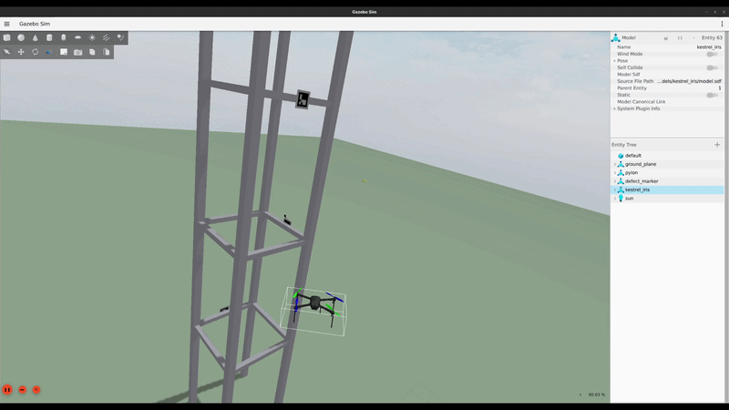
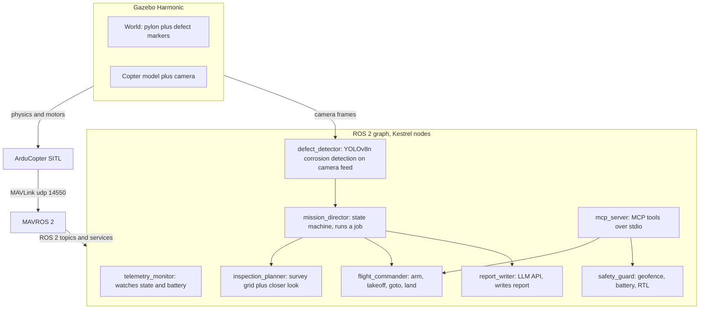
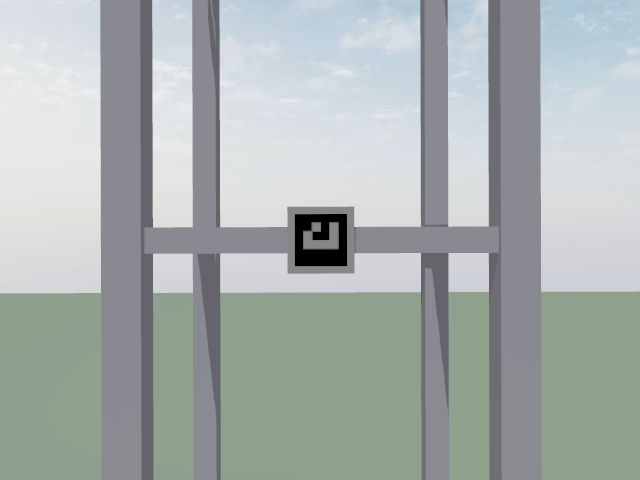

# Kestrel


See the project site with a live mission replay at
[ajnieves1.github.io/Kestrel](https://ajnieves1.github.io/Kestrel/).



The copter flies around a structure. It finds defects with a camera and an
onboard vision model. It flies close to each defect to confirm the defect.
It writes an inspection report in plain language.

## How it works



These steps happen during one mission:

1. `mission_director` asks `inspection_planner` for a survey path around the
   structure.
2. `mission_director` sends each waypoint to `flight_commander`.
3. `defect_detector` sends detections to `mission_director` during the whole
   flight.
4. When a detection occurs, `mission_director` pauses the survey. It sends
   the copter on a closer orbit around the defect.
5. The system stores each photo and each detection.
6. After the copter lands, `report_writer` writes a report in markdown
   format. The report includes the stored photos.

## Quick start

```bash
git clone https://github.com/ajnieves1/Kestrel.git
docker compose -f docker/compose.yaml build dev
docker compose -f docker/compose.yaml run --rm dev ros2 launch kestrel mission.launch.py headless:=true
```

To use the Gazebo GUI, remove `headless:=true` from the command. Before you
run the command, run `xhost +local:` on the host computer one time.

## Talk to it

The flight stack also works as an MCP server. An LLM client can fly the
simulation through this server. The client can ask for telemetry data. The
client can send a takeoff command. The client can send the copter to a
position. The client can send a land command. Every command goes through
the same guarded services that the autonomous mission uses. The safety
guard node keeps final control at all times.

Use this command to start the flight stack in a container named `kestrel`:

```bash
docker compose -f docker/compose.yaml --profile headless run --rm --name kestrel headless \
  bash -c "source install/setup.bash && ros2 launch kestrel sitl.launch.py headless:=true & \
           sleep 5 && ros2 run kestrel flight_commander & \
           sleep 2 && ros2 run kestrel safety_guard & wait"
```

If you use Claude Desktop on a Mac or a Windows computer, add this code to
the file `claude_desktop_config.json`:

```json
{
  "mcpServers": {
    "kestrel": {
      "command": "docker",
      "args": ["exec", "-i", "kestrel", "bash", "-c",
               "source /opt/ros/jazzy/setup.bash && source /ws/install/setup.bash && ros2 run kestrel mcp_server"]
    }
  }
}
```

If you use Claude Code on any computer, use this command instead:

```bash
claude mcp add kestrel -- docker exec -i kestrel bash -c \
  "source /opt/ros/jazzy/setup.bash && source /ws/install/setup.bash && ros2 run kestrel mcp_server"
```

Open a new session after you complete this step. Ask the client to check
the telemetry data. Ask the client to send the copter to an altitude of 3
meters. Ask the client to land the copter. The available tools are
`takeoff`, `goto`, `land`, `abort`, `get_telemetry`, and
`get_mission_state`. The system makes finished mission reports available
as MCP resources. Find them at `kestrel://reports`.

## Sample report

If you do not set an LLM API key, a full mission run writes a report with
an appendix only. See an example report at
[docs/sample_report.md](docs/sample_report.md).



## Model and data set

The corrosion detector uses a YOLOv8n model. The training data set is
[`Francesco/corrosion-bi3q3`](https://huggingface.co/datasets/Francesco/corrosion-bi3q3),
part of the Roboflow 100 benchmark. This data set uses a CC BY 4.0 license.
See [`models/vision/TRAINING.md`](models/vision/TRAINING.md) for the
training steps.

The four marker boards in the simulation show real corrosion photos from
the validation split of the data set. The detector did not train on these
specific photos. On the held out test split, the shipped ONNX model
reaches an mAP50 score of 0.621. At the production confidence threshold,
precision is 0.966 and recall is 0.530. These are true, measured results
from `scripts/eval_model.py` on real photos.

Live detection inside the simulation has a known limitation. A neural
network that trains on photographs does not reliably recognize the same
photograph when the simulation renders it as a flat texture under
simulated light. This is a real gap between simulated data and real data.
It is not a false result. See [docs/benchmarks.md](docs/benchmarks.md).

OpenCV ArUco detection is also available. Set the parameter
`detector_backend` to `aruco` to use it. The marker boards now show
corrosion photos instead of ArUco patterns. For this reason, the ArUco
detector also finds no markers in the current simulation. Earlier versions
of this project proved the ArUco detector reliable against ArUco marker
boards.

## Stack

| Piece | Role |
|---|---|
| ROS 2 Jazzy | Node graph, topics, and services |
| ArduPilot SITL | Flight controller simulation |
| MAVROS 2 | MAVLink bridge into ROS 2 |
| Gazebo Harmonic | Physics simulation and camera |
| YOLOv8n (ONNX) | Defect detector. OpenCV ArUco stays available as a fallback |
| LLM report writer | Claude, OpenAI, or Gemini. A parameter selects the provider |
| FastMCP | MCP server for conversational control by LLM clients |
| Docker | One development image for every computer |
| GitHub Actions | CI runs a real SITL flight test on every push |

## License

MIT
