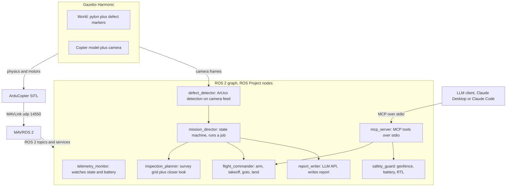

# ROS Project


Copter flies a structure, finds defects with onboard vision AI, flies closer
to confirm, and writes a plain language inspection report.

## How it works



One mission: `mission_director` asks `inspection_planner` for a survey path
around the structure, feeds waypoints to `flight_commander`, `defect_detector`
streams detections the whole time, on a detection the director pauses the
survey and requests a closer orbit of that point, photos and detections
accumulate, after landing `report_writer` turns them into a markdown report
with photos embedded.

## Quick start

```bash
git clone https://github.com/ajnieves1/Kestrel.git
docker compose -f docker/compose.yaml build dev
docker compose -f docker/compose.yaml run --rm dev ros2 launch kestrel mission.launch.py headless:=true
```

For the Gazebo GUI instead of headless, drop `headless:=true` and run
`xhost +local:` on the host once first.

## Talk to it

The flight stack doubles as an MCP server, so an LLM client can fly the sim
and do the following: ask for telemetry, command a takeoff, send it to a
position, land it. Every command routes through the same guarded services
the autonomous mission uses, and the safety guard keeps final authority.

Start the flight stack in a container named `kestrel`:

```bash
docker compose -f docker/compose.yaml --profile headless run --rm --name kestrel headless \
  bash -c "source install/setup.bash && ros2 launch kestrel sitl.launch.py headless:=true & \
           sleep 5 && ros2 run kestrel flight_commander & \
           sleep 2 && ros2 run kestrel safety_guard & wait"
```

Claude Desktop (Mac or Windows), add to `claude_desktop_config.json`:

```json
{
  "mcpServers": {
    "kestrel": {
      "command": "docker",
      "args": ["exec", "-i", "kestrel", "bash", "-c",
               "source /opt/ros/jazzy/setup.bash && source /ws/install/setup.bash && ros2 run kestrel mcp_server"]
    }
  }
}
```

Claude Code (any platform), one command instead:

```bash
claude mcp add kestrel -- docker exec -i kestrel bash -c \
  "source /opt/ros/jazzy/setup.bash && source /ws/install/setup.bash && ros2 run kestrel mcp_server"
```

Then open a new session and ask it to check telemetry, take off to 3
meters, or land. Tools: `takeoff`, `goto`, `land`, `abort`,
`get_telemetry`, `get_mission_state`. Finished mission reports are exposed
as MCP resources under `kestrel://reports`.

## Sample report

A full mission run with no LLM API key set writes an appendix only report:
[docs/sample_report.md](docs/sample_report.md).


## Stack

| Piece | Role |
|---|---|
| ROS 2 Jazzy | Node graph, topics, services |
| ArduPilot SITL | Flight controller simulation |
| MAVROS 2 | MAVLink bridge into ROS 2 |
| Gazebo Harmonic | Physics sim and camera |
| OpenCV ArUco | v1 defect detector |
| LLM report writer | Claude, OpenAI, or Gemini, provider chosen by a parameter |
| FastMCP | MCP server, LLM clients fly the sim conversationally |
| Docker | One dev image on every machine |
| GitHub Actions | CI with a real SITL flight test on every push |

## License

MIT
