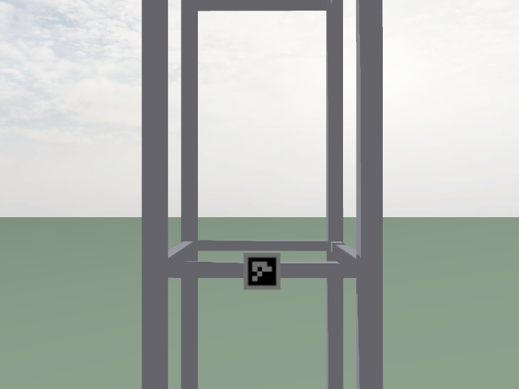
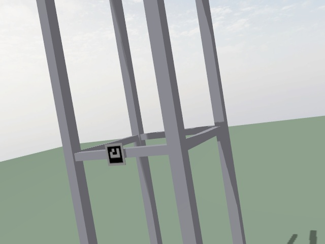
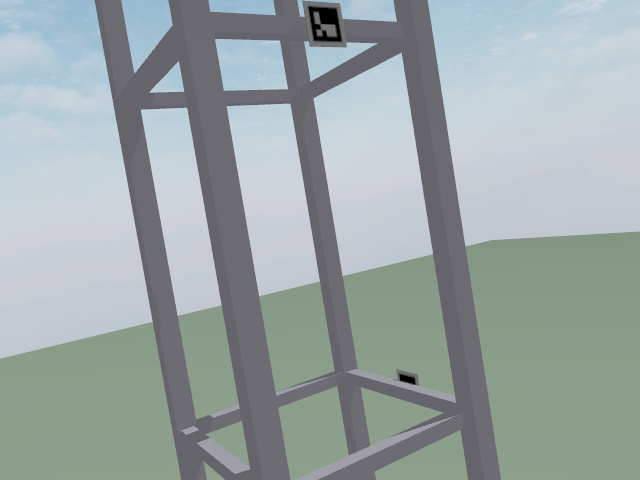
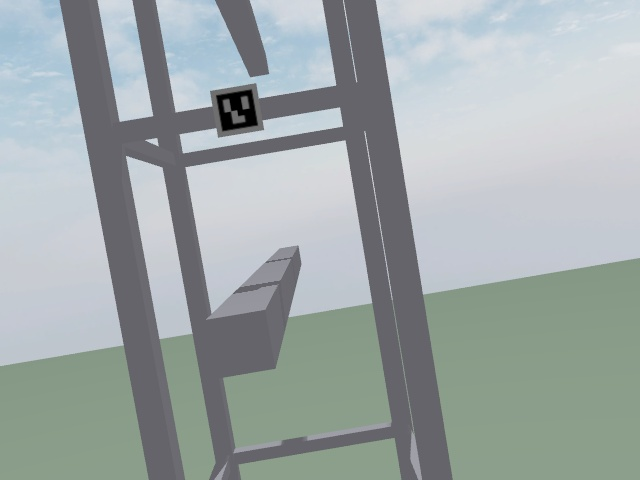

# Inspection report, 2026-07-17

| Start | Duration | Defects found | Provider | Model |
|---|---|---|---|---|
| 2026-07-17 16:38:09 | 344.5s | 4 | none | none |

## Findings

No findings are available. The system found no API key, or the request failed.

## Changes

This is the first inspection of this site. There is no previous mission to compare.

## Appendix, raw detections

| Label | Confidence | North | East | Altitude | Photo |
|---|---|---|---|---|---|
| marker_0 | 1.00 | 14.78 | 0.00 | 4.68 |  |
| marker_1 | 1.00 | 13.83 | -0.25 | 9.87 |  |
| marker_2 | 1.00 | 15.23 | 0.76 | 16.17 |  |
| marker_3 | 1.00 | 15.21 | 0.16 | 20.58 |  |
